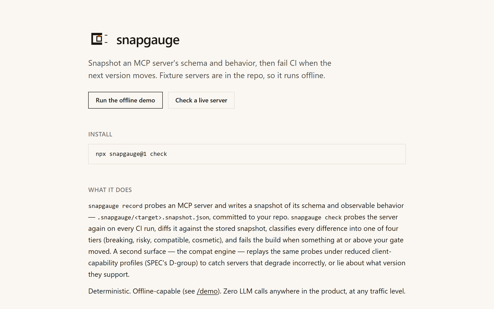
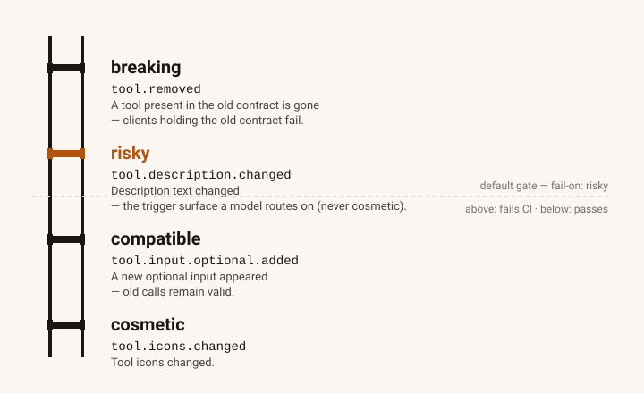

<p align="left">
  
</p>

# snapgauge

**Contract tests for MCP servers. Record a snapshot of a server's schema and
observable behavior; fail CI when the next version moves. Deterministic,
offline-capable, zero LLM.**

> **Status: pre-release, M0–M7 landed; not yet published.** The design in
> [docs/SPEC.md](docs/SPEC.md) is approved and frozen for v1; implementation
> landed milestone by milestone (SPEC §10) and every claim below is backed by
> the receipts in the five-stage CI. `1.0.0-rc.1` is built, pack-checked
> (a real `npm install <tarball>` + `snapgauge diff` in a clean scratch
> directory — see `pnpm ci:pack-check`), and ready for `pnpm publish`; the
> actual publish and the first push of a `v*` tag are James's call, not this
> build's (`.github/workflows/release.yml` is committed, unrun).
>
> Working today, proven by the eight-stage CI (typecheck → lint → unit →
> e2e:smoke → eval → build → pack-check → brand/diagram/docs-drift) and 333
> tests (281 unit + 52 eval, including 37 golden/compat cases at 100% exact
> match, SPEC §7's ≥30-case bar): the full snapshot + diff + compat/degradation
> engine (`record`/`check`/`diff`/`compat`/`ci`) over `http`, `stdio`, and
> `fixture` transports; the CLI; the composite [`action.yml`](action.yml)
> GitHub Action; and the demo site — `/` (static), `/demo` (the real engine,
> offline, in a Web Worker), `/live` + `POST /api/check` (an SSRF-guarded,
> rate-limited, read-only live audit of a visitor-named server), `/docs`, and
> `/board` (the schema, the weekly Actions job, the disclosure-policy
> validator, and the render path are all built and tested —
> `boards/roster.json` ships empty on purpose, since which public servers
> belong on it is James's call, SPEC §11 Q1, so `/board` still shows the
> honest empty state until that's decided).

## A real diff

Two recorded snapshots of the same fixture server, one version apart
(`clean@v1` → `drift-breaking@v2`, `packages/fixtures/src/drift.ts`), diffed
by the real engine — not a hand-written example:

```
breaking   tool.input.required.added          tools.get_weather.inputSchema.required.date — input "date" is now required — a client recorded against the old contract does not send it
breaking   tool.removed                       tools.archive_note — tool "archive_note" was removed — a client holding the old contract will fail
risky      tool.description.changed           tools.get_weather.description — description changed — the trigger surface a model routes on (SPEC §5: risky, not cosmetic)
compatible tool.input.optional.added          tools.list_notes.inputSchema.properties.cursor — optional input "cursor" was added
cosmetic   serverInfo.version.changed         discover.serverInfo.version — serverInfo.version changed
cosmetic   tool.icons.changed                 tools.get_weather.icons — icons changed
6 findings (2 breaking, 1 risky, 1 compatible, 2 cosmetic); gate fail-on=risky -> DRIFT (exit 1)
```

Same pair, live: [snapgauge.vercel.app](https://snapgauge.vercel.app) renders
this exact diff in the page, computed at build time from the same fixtures.
Full taxonomy and why descriptions are `risky` rather than cosmetic:
[docs](https://snapgauge.vercel.app/docs#diff-taxonomy).

## Watch it run



Recording (webm, muted, no audio) of the pair above, run on the deployed
`/demo`: [snapgauge.vercel.app](https://snapgauge.vercel.app) — the video is
embedded directly on the landing page.

## The four tiers



Generated by `scripts/diagram.mjs` from the same rule registry as
`docs/RULES.md` — `pnpm diagram` regenerates it, CI fails on drift
(`pnpm ci:diagram-check`). `risky` is the one amber rung on purpose: a tool's
description and title are the trigger surface a model routes on, so a
rewrite is treated as a behavior change, not a cosmetic one.

## Why

The official MCP conformance suite answers "does this server obey the spec
today". snapgauge answers a different question: **did *this* server change
against its own recorded contract — and does it still work with a client one
version back?** A tool description rewrite, a new required argument, or a
reordered `tools/list` never trips a spec check, but each one silently changes
what an agent connected to that server will do. The two are **complementary**,
not competing — run the [official conformance
suite](https://github.com/modelcontextprotocol/conformance) to check spec
compliance today; run snapgauge to catch what changed since your last release.

| | official conformance suite | snapgauge |
|---|---|---|
| Question | Does this server obey the spec, right now? | Did *this* server change vs. its own recorded contract — and how does it behave one client-version back? |
| Method | Scenario-based, wire-schema validated, run fresh every time. | Recorded snapshot diff (self-vs-self over time) + degradation profiles across client capability sets. |
| Output | Pass/fail against the 2026-07-28 revision. | Tiered findings (breaking/risky/compatible/cosmetic) with an exit code CI can gate on. |
| When it runs | Any time, against any server, no history required. | After the first `snapgauge record` — it needs a prior snapshot to compare against. |

**This is a SHARP TOOL — one job, done deterministically, not a flagship
product:** no dashboard, no accounts, no roadmap of adjacent features. It
answers exactly the drift/compatibility question above and nothing else; see
Non-goals and Limitations below for what it deliberately does not attempt.

## Install

```
npx snapgauge@1 init --url https://mcp.example.com/mcp   # or --command / --fixture
npx snapgauge@1 record                                    # writes .snapgauge/<target>.snapshot.json
npx snapgauge@1 check                                      # probe live -> diff vs stored -> gate -> exit code
```

Or as a GitHub Action, against a snapshot already committed to your repo:

```yaml
- uses: jamessuuu/snapgauge@v1
  with:
    config: snapgauge.config.json   # default
    fail-on: risky                  # default (SPEC §5)
    # target: my-server             # only needed when the config has more than one
```

See [`action.yml`](action.yml) for every input/output; it runs `snapgauge check`
and turns the result into GitHub Actions annotations plus a job summary table,
reusing `snapgauge report` (the same pure reformatter the CLI itself uses) —
no second live check against your server to build the summary.

## Quickstart

The diff at the top of this README, reproduced on your own machine, no MCP
server of your own required:

```
git clone https://github.com/jamessuuu/snapgauge
cd snapgauge && pnpm install && pnpm --filter snapgauge build
node packages/snapgauge/dist/cli/index.js record demo --fixture clean@v1 --dir /tmp/snapgauge-demo
node packages/snapgauge/dist/cli/index.js record demo-v2 --fixture drift-breaking@v2 --dir /tmp/snapgauge-demo
node packages/snapgauge/dist/cli/index.js diff /tmp/snapgauge-demo/demo.snapshot.json /tmp/snapgauge-demo/demo-v2.snapshot.json
```

Full five-minute walkthrough, the snapshot format, and why it captures shape
rather than values: [docs](https://snapgauge.vercel.app/docs#quickstart).

## Non-goals

No security scanning, tool-poisoning heuristics, or trust scores. No LLM
anywhere in the product. No re-implementation of the official conformance
suite. The hosted demo never accepts a bearer token and never calls
`tools/call` on a third-party server — neither does the board (SPEC §1/§8).

## Limitations

- **Auth-gated tools.** The hosted `/live` check never accepts a bearer
  token, so it can only audit a server's unauthenticated discovery surface.
  The CLI/CI path supports auth via `${ENV}`-interpolated headers in
  `snapgauge.config.json` — the token stays in your own environment.
- **Per-tenant tool sets.** If a server returns a different `tools/list` per
  API key, snapgauge only ever sees the one it was configured to see.
- **Genuinely non-deterministic output.** Shape-capture (the default)
  absorbs most value churn, but a tool that returns a random *schema shape*
  will read as flaky drift.
- **stdio's narrower assertion set.** The T-group framing assertions
  (SPEC §5) require an HTTP layer — over `stdio` they report `n/a (stdio)`,
  with the reason printed, never silently passed.

## Exit codes

Load-bearing for CI (SPEC §5). `1` vs `3` is deliberate: different owner,
different fix — `1` is a decision for the person maintaining the *client
integration or the recorded snapshot* (is this drift intentional? update the
snapshot or fix the server); `3` means *the server itself* is not honoring
the spec's degradation contract.

| Code | Meaning | Who fixes it |
|---|---|---|
| 0 | Clean — no findings at/above the gate. | Nobody — nothing to do. |
| 1 | Drift at/above the gate (`--fail-on`, default `risky`). | The consumer: review the diff, then either `--update` the stored snapshot (drift was intentional) or fix/pin the server. |
| 2 | Probe/connection failure (unreachable, auth, timeout, malformed response). | The consumer's environment/config — check the target URL, credentials, and network reachability. |
| 3 | Compat/degradation violation — the server is wrong, not merely different. | The server's maintainer — it violates the 2026-07-28 revision's degradation contract. |
| 4 | Usage/config/snapshot-format error (incl. probe-spec mismatch: re-record). | The consumer — fix the CLI invocation or config, or re-run `snapgauge record`. |
| 5 | Internal error — a bug in snapgauge itself. | snapgauge's maintainer — please [report it](SECURITY.md#reporting). |

Full failure-mode contract (target unreachable, stdio hangs, rate limits,
board dead-man banner, and more): [docs](https://snapgauge.vercel.app/docs#failure-modes).

## Monorepo

| Package | Purpose |
|---|---|
| `snapgauge` | The published package: core engine (isomorphic, zero I/O), node transports, CLI. |
| `@snapgauge/fixtures` | Private. Pure `(request, profile) => response` fixture servers for the eval set and the offline demo. |
| `apps/web` | Next.js demo site — `/`, `/demo`, `/live` + `/api/check`, `/docs`, `/board`. |

Root [`action.yml`](action.yml) is the published composite GitHub Action
(`uses: jamessuuu/snapgauge@v1`), not a workspace package.

---

Part of the [Agent James](https://agentjames.vercel.app) portfolio.
Built by James Lorenz Santos. Code MIT; brand assets excluded (see LICENSE).
